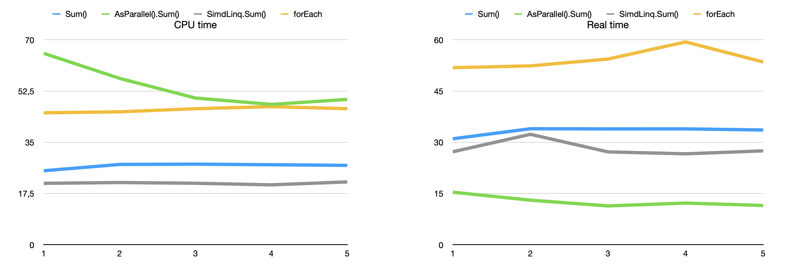

# Examining the power usage effects of Linq's asParalell() and Simd

In a previous (post)[] we discovered that using Linq's `.asParalell()` can significantly reduce the time taken to iterate over a large list, at least for the purposes of summing its elements. However, since this makes the iteration to be parallelized over several cores it remains unclear what effect this has on CPU use and energy efficiency.

In order to study the energy efficiency we will use, as a proxy the total CPU time used. We will create four programs each summing a list of 1 billion numbers. Each program will be timed using the `time` command which emits both the time a program takes to run but also the CPU time it uses to run. The programs will use the following methods to sum the numbers:

  * A foreach loop
  * Linq's `.Sum()`
  * Linq's `asParallel().Sum()`
  * SimdLinq's `.Sum()``

We include [SimdLinq](https://github.com/Cysharp/SimdLinq), which uses the CPU's ability to process the Same Instruction with Multiple Data (SIMD) at the same time using special CPU instructions. It should be noted that I am running this experiment on a Macbook with an M2 CPU. The performance of SIMD might differ significantly on other architectures. A big thanks to Eirik Sangolt for alerting me to the existence of SimdLinq.

The real and CPU (user + sys) times for running each of the programs 5 times can be seem in the graphs below. Averages and minimum times are also shown in the tables below that.

It seems that while using asParalell() to make Linq do things in parallel achieves superior performance it comes at a cost of using the most CPU time. Thus there seems to be  tradeoff here and effects on sustainability may not be all that clear and probably depends on the specific circumstances. 

For the non-parallel options SimdLinq is slightly, though consistently faster and consumes less CPU time than Linq's `.Sum()` while foreach remains the slowest option and also consumes the most CPU time second only to `asParallel()`. It remains unclear which of Linq and SimdLinq's `Sum()` consumes the most energy as they use different instruction sets. However, based on these results both seems like good options.

Averages:

| Method | Real | User | Sys | Total CPU |
|--------|------|------|-----|-----------|
| Sum()	| 33.28	    | 12.844     | 14.088  | 26.932 |
|AsParallel().Sum()| 12.7 | 30.162 | 23.81 | 53.972|
|SimdLinq.Sum()	|28.164	|6.518	|72.55	|21.028|
|forEach	|54.284|	30.87|	15.238|	46.108|

Minimums:
| Method | Real | User | Sys | Total CPU |
|--------|------|------|-----|-----------|
|Sum()|	31.02|	12.844|	14.088|	26.932|
|AsParallel().Sum()	|11.37	|30.162	|23.81	|53.972|
|SimdLinq.Sum()	|26.62|	6.518|	72.55|	21.028|
|forEach	|51.83	|30.87|	15.238|	46.108|

For those interested, the code for this experiment is available in the file [Linq asParalell() effect on power use](https://github.com/kentis/green_code_experiments/tree/main/Experiments/Linq%20asParalell\(\)%20effect%20on%20power%20use), feel free to submit an issue or pull-request if you feel that this experiment should be improved.

Which performance and/or sustainability question should I pursue next?