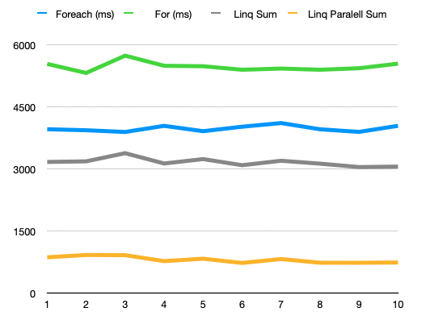

# C# Summing Up Numbers: Linq vs foreach vs for

Loos are of particular interest when seeking to optimize for sustainability and/or performance. 
While it is well known that loops are constructs that allows us to do things many times,
what is sometimes forgotten is that the thing in the loop tends to be done many times.

In c# three common ways, there are of course others, to do loops is the `for`, `foreach` loops through `Linq`
which provides ways to do all kinds of things to collections, including looping over them.

In order to study the performance and sustainability of each of these methods to loop over the elements in a list
we will look use each method to get the sum of a large amount of numbers. To do this we have created a .Net program that
sums the numbers 1-1000000000 using a foreach loop, a for loop and Linqs Sum() method. Additionally we use Linq's way to parallelize the Summing by calling `AsParallel()` on the collection before summing, just to see what happens.
 
The results for running the experiments are shown below. As we can see, the traditional for-loop was by far the slowest opting, while Linq's Sum() was about halfway between the for and the foreach loop. Linq's parallel was significantly faster than any of the other methods. However, since the parallel in theory might bee accessing multiple cores, further studies are needed to make any claim in the energy efficiency of this method. Until then it seems likely that the foreach loop is generally a good choice when looping over large lists.

|Run #|Foreach (ms)  | For (ms)         | Linq Sum   | Linq Paralell Sum |
|-----|--------------|------------------|------------|-------------------|
|1    | 4579         | 6465             | 5858       | 1046              |
|2    | 4798         | 6575             | 5928       | 1027              |
|3    | 4647         | 6623             | 6072       | 1120              |
|4    | 4754         | 6883             | 5803       |  824              |
|5    | 4687         | 6631             | 5925       |  816              |
|6    | 4809         | 6523             | 5763       |  890              |
|7    | 4723         | 6432             | 5832       |  806              |
|8    | 4766         | 6468             | 5965       |  987              |
|9    | 4689         | 6856             | 5729       |  776              |
|10   | 4738         | 6530             | 5799       |  880              |
|-----|--------------|------------------|------------|-------------------|
| Avg | 4719	     | 6599	            | 5867	     | 917               |

Are there any interesting looping methods I missed in this study?

What are some other common tasks that can be done in several different ways with possible performance and energy use implications?1

For those interested, the code for this experiment is available in the file [Program.cs](https://raw.githubusercontent.com/kentis/green_code_experiments/refs/heads/main/Experiments/Summing%20numbers%20linq%20vs%20foreach/code/Program.cs?token=GHSAT0AAAAAACZ47PO5AINMDYCBSHYHTGHAZ4UUUUQ), feel free to submit an issue or pull-request if you feel that this experiment should be improved. I re-ran this experiment while varying the order the different ways to parse the dates to ensure consistent results and reduce sources of bias. There did not seem to be any significantly different results from what is presented above.

